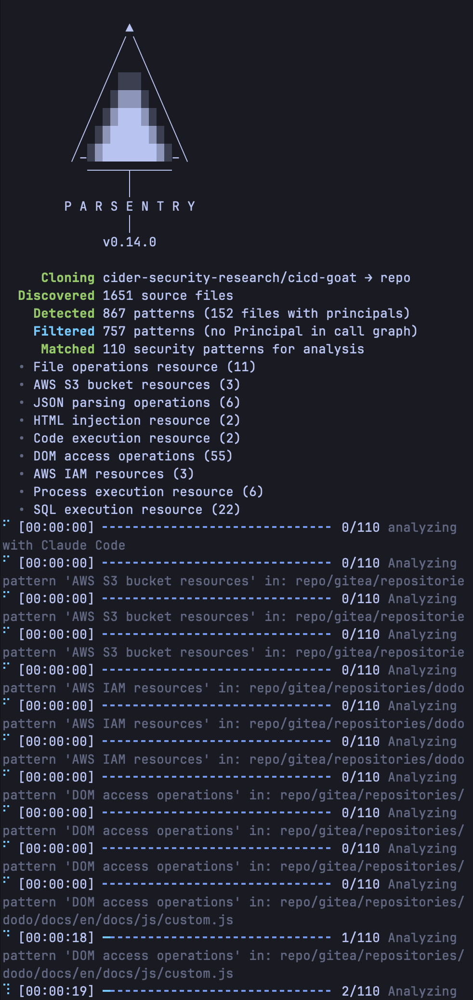
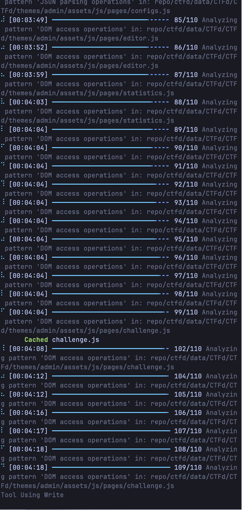
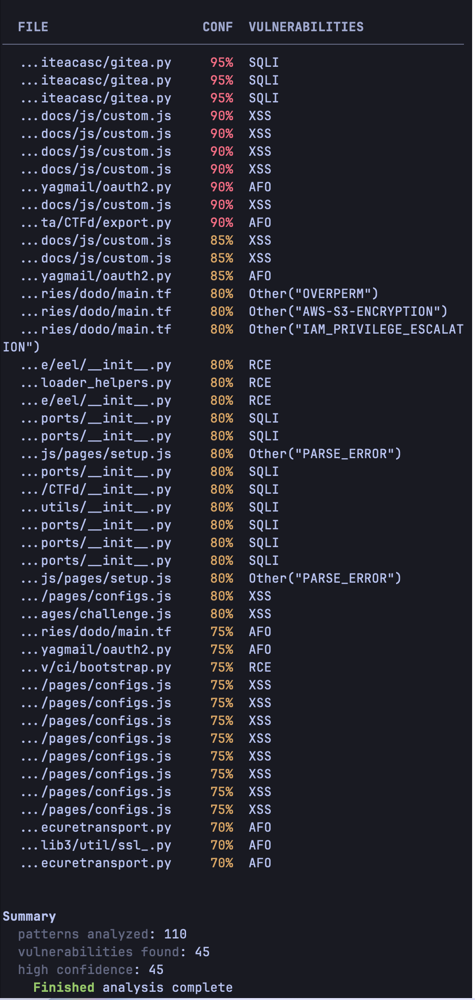

<div align="center">

  

**Parallel CLI agent execution platform with caching.**

Parsentry uses static analysis to enumerate isolated components, then dispatches them to CLI agents for parallel analysis.
Run large-scale agent tasks faster with deduplication and result caching.

</div>

[](https://deepwiki.com/HikaruEgashira/parsentry)

### How it works

1. **Component Enumeration** — Analyze repo metadata, enumerate isolated surfaces (endpoints, tables, public APIs, etc.)
2. **Pattern Matching** — Tree-sitter finds code patterns in component locations
3. **Prompt Generation** — Output analysis prompts to stdout, pipe to any CLI agent
4. **Caching** — SHA2-based result cache prevents duplicate agent executions

```bash
# Scan and pipe to Claude Code
parsentry owner/repo | claude

# Generate threat model prompt
parsentry model owner/repo | claude

# Pattern match with threat model
parsentry model repo > model.json
parsentry query repo --threat-model model.json
```

### Supported Languages

`C, C++, Go, Java, JavaScript, Python, Ruby, Rust, TypeScript, Terraform`

<div align="center">
  
  
  
</div>

### Prerequisites

Parsentry generates analysis prompts. You need a CLI agent to process them:

```bash
# Install Claude Code (recommended)
npm install -g @anthropic-ai/claude-code
```

Any CLI that reads stdin works: `claude`, `codex`, `aider`, etc.

### Installation

```bash
# Via mise (recommended)
mise use -g github:HikaruEgashira/parsentry

# Via cargo
cargo install parsentry

# Or download binary from GitHub Releases
```

Download the latest release for your platform from [GitHub Releases](https://github.com/HikaruEgashira/parsentry/releases).

### Quick Start

```bash
# 1. Generate threat model and analyze with Claude
parsentry model owner/repo | claude

# 2. Or scan a local project
parsentry model . | claude

# 3. Only scan changed files (great for PR reviews)
parsentry model . --diff-base origin/main | claude
```

### Usage

```bash
# Analyze a GitHub repository
parsentry owner/repository

# Analyze a local directory
parsentry /path/to/code

# Only scan changed files against a base branch
parsentry owner/repository --diff-base origin/main
```

### Command Line Options

```
Usage: parsentry [OPTIONS] [TARGET] [COMMAND]

Commands:
  model  Generate analysis prompt from repo metadata
  query  Run tree-sitter pattern matching (JSON output)
  cache  Manage result cache

Arguments:
  [TARGET]  Local path or GitHub repository (owner/repo)

Options:
  --diff-base <REF>              Git ref to diff against
  --filter-lang <LANG>           Filter by language (comma-separated)
  --threat-model <PATH>          Path to threat model JSON
  -v, --verbosity                Increase verbosity
  --generate-config              Print default config
```

### Architecture

| Crate | Role |
|-------|------|
| `parsentry-core` | Language, RepoMetadata, ThreatModel types |
| `parsentry-parser` | Tree-sitter pattern matching |
| `parsentry-executor` | Parallel CLI agent execution |
| `parsentry-cache` | Task result cache |
| `parsentry-reports` | SARIF/Markdown reports |
| `parsentry-utils` | File classification/discovery |

### Example Reports

- [skills/secure-code-game](docs/reports/skills-secure-code-game/summary.md) - Security challenges across multiple languages
- [harishsg993010/damn-vulnerable-MCP-server](docs/reports/harishsg993010-damn-vulnerable-MCP-server/summary.md) - MCP Server
- [bridgecrewio/terragoat](docs/reports/terragoat/summary.md) - Terraform
- [RhinoSecurityLabs/cloudgoat](docs/reports/cloudgoat/summary.md) - Infrastructure as Code (IaC)
- [NeuraLegion/brokencrystals](docs/reports/NeuraLegion-brokencrystals/summary.md) - Typescript
- [OWASP/NodeGoat](docs/reports/NodeGoat/summary.md) - Node.js
- [OWASP/railsgoat](docs/reports/railsgoat/summary.md) - Ruby on Rails
- [dolevf/Damn-Vulnerable-GraphQL-Application](docs/reports/Damn-Vulnerable-GraphQL-Application/summary.md) - GraphQL
- [cider-security-research/cicd-goat](docs/reports/cicd-goat/parsentry-results.sarif) - CI/CD Pipeline

### Security

This tool is intended for security research and educational purposes only. Do not use the example vulnerable applications in production environments.

### License

AGPL 3.0
